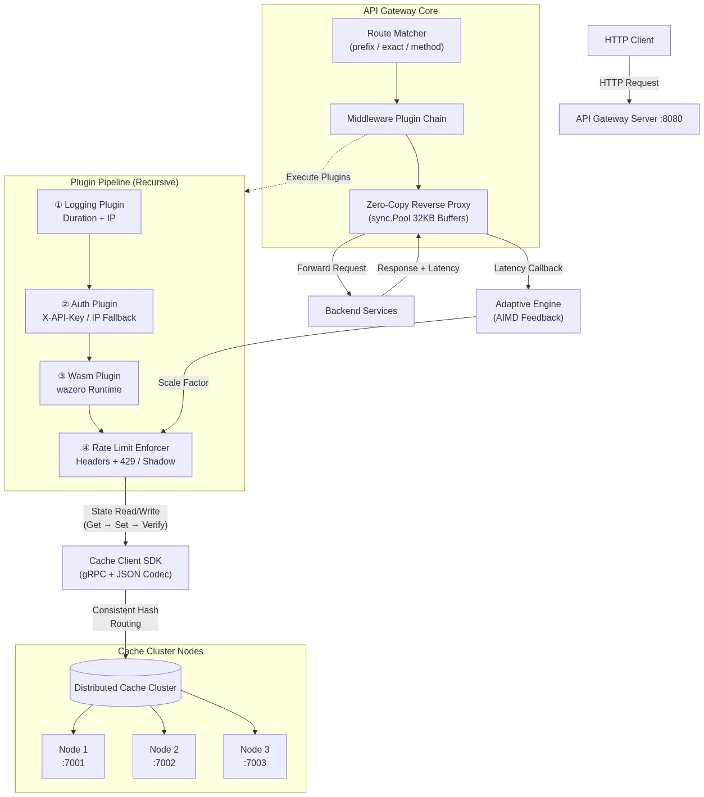
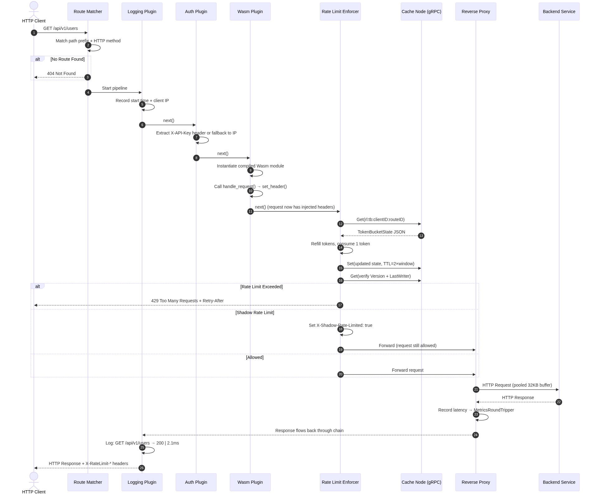
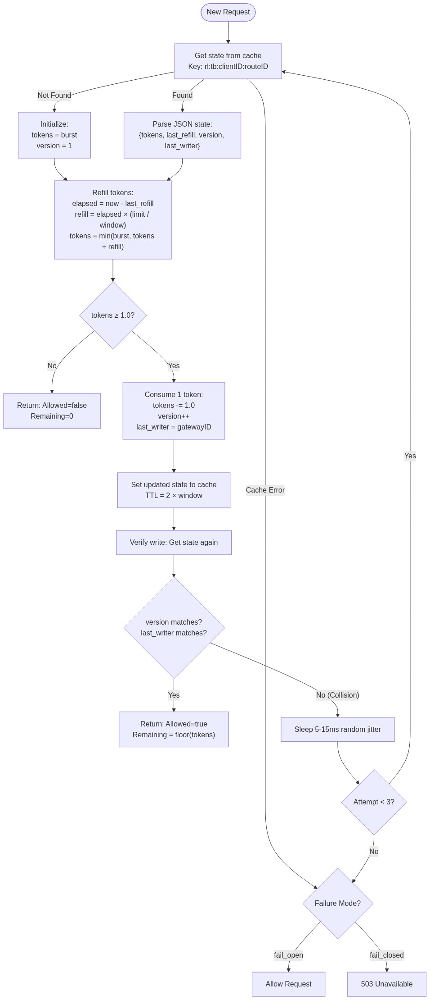
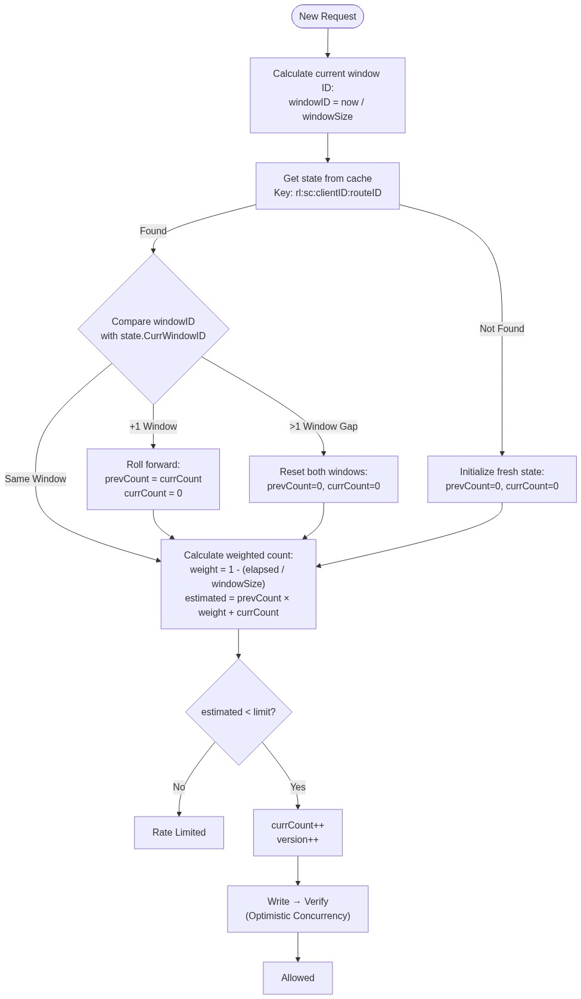
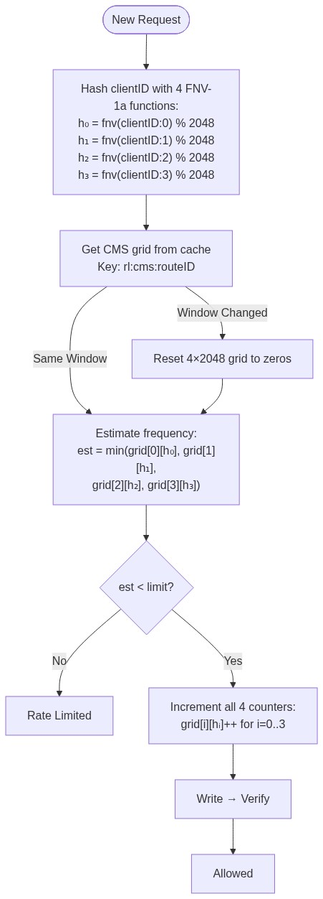
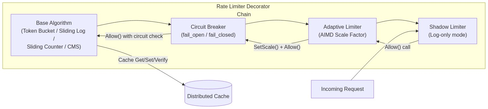
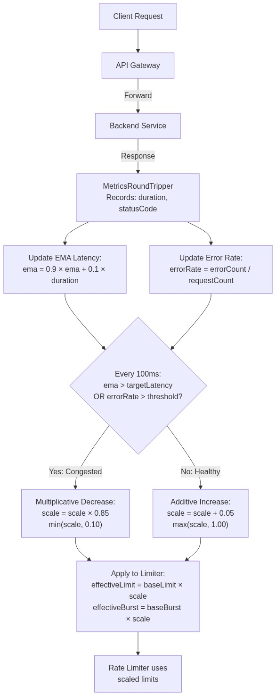
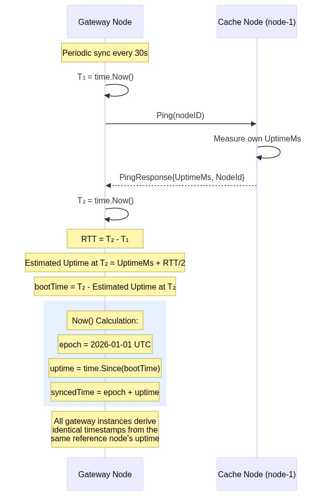
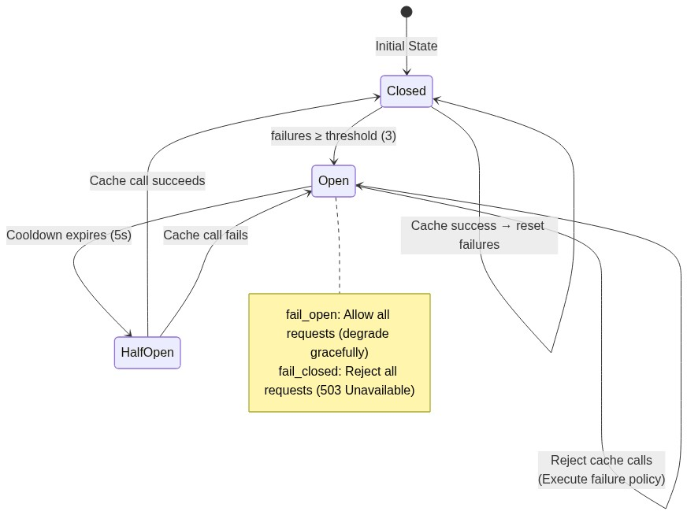
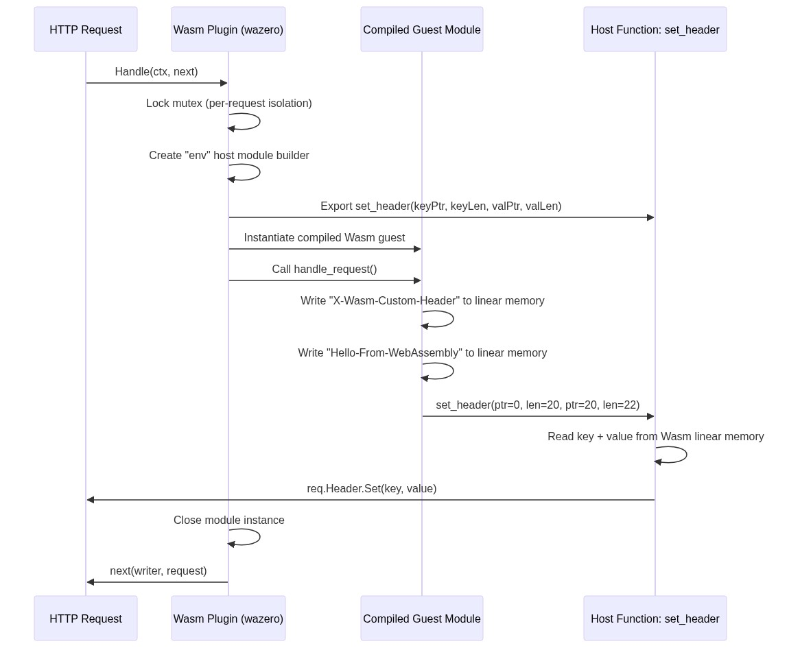

# Distributed API Gateway & Rate Limiter: End-to-End Architectural Guide

A production-style, ultra-high-performance API Gateway and Distributed Rate Limiter built in Go. This system sits in front of backend services and enforces per-client, per-route rate limits using multiple algorithms. It is tightly integrated with the sharded distributed cache cluster ([distributed_cache_system](https://github.com/AbhinayAmbati/distributed_cache_system)) as its shared state store, achieving coordinate-free horizontal scalability across multiple gateway instances without external third-party dependencies like Redis.

The gateway provides request routing, pluggable middleware (authentication, logging, WebAssembly-based request transformation), four distinct rate-limiting algorithms, adaptive congestion control, shadow rate limiting for observability, circuit breaker failure policies, and a latency-corrected distributed clock synchronizer.

---

## Overall System Architecture

The gateway intercepts every inbound HTTP request, matches it against a set of configured routing rules, runs a recursive sequence of middleware plugins, and proxies approved requests to the downstream backend services. Rate limiting state is persisted to the distributed cache cluster over gRPC, enabling multiple gateway instances to share a unified view of client request counts.



### Core Components

1.  **Gateway Server (`gateway/server.go`)**: The primary HTTP listener and orchestrator. It initializes cache connections, clock synchronization, rate limiters (with decorator wrapping), and the plugin pipeline. On each request, it performs route matching, resolves or lazily creates a reverse proxy for the matched backend, and hands off execution to the middleware chain.

2.  **Wildcard Router (`gateway/router.go`)**: Matches inbound requests against configured routes using prefix matching (e.g., `/api/v1/users` matches `/api/v1/users/123`), exact path matching, and HTTP method matching. Supports wildcard methods (`*`) for routes that accept any HTTP verb.

3.  **Recursive Middleware Pipeline (`gateway/middleware.go`)**: Inspired by Kong's plugin architecture, the pipeline executes plugins in a recursive chain. Each plugin receives a shared `Context` (holding the `http.Request` and `http.ResponseWriter`) and a `next` function. A plugin can inspect/modify the request, short-circuit the pipeline (e.g., returning 429), or delegate to the next plugin. The chain is constructed as a closure-based recursive builder that compiles at request time.

4.  **Zero-Copy Reverse Proxy (`gateway/proxy.go`)**: Uses Go's `httputil.ReverseProxy` with a custom `BytesBufferPool` backed by `sync.Pool`. Each buffer is 32KB, and buffers are recycled across requests to eliminate heap allocations during data forwarding. A custom `MetricsRoundTripper` wraps the default HTTP transport to intercept every backend response, recording latency and status code for the adaptive rate limiting feedback loop.

5.  **Clock Synchronizer (`ratelimit/clocksync.go`)**: Periodically ping-probes a reference cache node to estimate a latency-corrected virtual timeline. This eliminates wall-clock skew across multiple gateway instances, ensuring all nodes compute identical rate-limiting windows.

6.  **Rate Limiting Engine**: Four pluggable algorithms (Token Bucket, Sliding Window Log, Sliding Window Counter, Count-Min Sketch) that read/write state to the distributed cache. All algorithms implement optimistic concurrency control with write-then-read verification.

7.  **Adaptive Engine (`ratelimit/adaptive.go`)**: A TCP Congestion Control-inspired AIMD (Additive Increase, Multiplicative Decrease) feedback loop that monitors backend latency and error rates, dynamically scaling rate limits to prevent cascading failures.

8.  **Wasm Executor (`plugins/wasm.go`)**: Integrates the `wazero` zero-dependency WebAssembly runtime to compile and execute sandboxed request-transformation modules. Guest modules can inject HTTP headers by calling host-exported functions that read from the Wasm linear memory.

---

## End-to-End Request Processing Flow

When a request arrives at the gateway, it traverses the full pipeline: route matching → logging → authentication → Wasm transformation → rate limit enforcement → reverse proxy forwarding → response.



### Detailed Pipeline Steps

1.  **Route Matching**: The router iterates over all configured routes and tests the request path against each route's pattern. Prefix matching is used: a route configured as `/api/v1/users` matches any path starting with that prefix. If the route specifies a method (e.g., `GET`), only that method matches; a wildcard `*` method matches all HTTP verbs. If no route matches, the gateway returns `404 Not Found` with a JSON error body.

2.  **Logging Plugin**: Records the request start time. After the entire pipeline completes (including the backend response), it logs the HTTP method, path, response status code, total duration, and client IP address.

3.  **Auth Plugin**: Extracts the client identity from the `X-API-Key` request header. If no API key is present, it falls back to the client's IP address (extracted from `X-Forwarded-For` or `RemoteAddr`). This identity becomes the `clientID` used as the rate-limiting key.

4.  **Wasm Plugin**: If the matched route has a `wasm_plugin` path configured, the gateway loads and compiles the `.wasm` binary at startup. On each request, it instantiates a fresh guest module (ensuring thread safety), exports host functions into the `env` namespace, and calls the guest's `handle_request()` export. The guest can call back into the host to set HTTP headers on the request before it reaches the backend.

5.  **Rate Limit Enforcer**: Queries the appropriate rate limiter for the matched route. The limiter reads state from the distributed cache, evaluates whether the request should be allowed, and writes updated state back. The enforcer injects standard rate limit headers (`X-RateLimit-Limit`, `X-RateLimit-Remaining`, `X-RateLimit-Reset`) into every response. If the request is denied, it returns `429 Too Many Requests` with a `Retry-After` header.

6.  **Reverse Proxy**: Forwards the approved request to the backend service using pooled byte buffers. The `MetricsRoundTripper` captures the backend response latency and HTTP status code, feeding them to the adaptive engine for AIMD calculations.

---

## Rate-Limiting Algorithms

All four algorithms share a common `RateLimiter` interface and use the distributed cache as their state store. Each algorithm supports dynamic scaling (via `SetScale(factor)`) for adaptive rate limiting.

### 1. Token Bucket

The Token Bucket algorithm is ideal for handling traffic bursts. Tokens are refilled at a constant rate based on elapsed time, and each request consumes one token.



#### Cache State Schema
```json
{
  "tokens": 8.5,
  "last_refill": 1752345678000,
  "version": 42,
  "last_writer": "gw-1"
}
```

#### How It Works
- **Refill Calculation**: On each request, the elapsed time since `last_refill` is computed using the synchronized clock. Tokens are refilled proportionally:
  $$\text{refill} = \text{elapsed\_ms} \times \frac{\text{limit}}{\text{window\_ms}}$$
  $$\text{tokens} = \min(\text{burst}, \text{tokens} + \text{refill})$$
- **Consumption**: If `tokens >= 1.0`, the request is allowed and one token is consumed. Otherwise, the request is denied.
- **Burst Handling**: The `burst` parameter caps the maximum tokens, allowing a burst of requests up to that value even if the steady-state rate is lower.
- **Cache Key**: `rl:tb:{clientID}:{routeID}` — scoped per client and per route.

### 2. Sliding Window Log

The Sliding Window Log provides the most accurate rate limiting by tracking individual request timestamps. It stores a JSON array of Unix millisecond timestamps in the cache.

#### Cache State Schema
```json
{
  "timestamps": [1752345678000, 1752345678100, 1752345678200],
  "version": 15,
  "last_writer": "gw-2"
}
```

#### How It Works
- **Eviction**: On each request, all timestamps older than `now - window_size` are filtered out.
- **Evaluation**: If the count of remaining timestamps is less than the configured `limit`, the request is allowed and the current timestamp is appended.
- **Reset Calculation**: The reset duration is computed from the oldest surviving timestamp: `resetIn = oldest + window - now`.
- **Trade-off**: This algorithm is the most precise but can be memory-intensive for high-traffic routes, since every request timestamp is stored individually.
- **Cache Key**: `rl:sl:{clientID}:{routeID}`

### 3. Sliding Window Counter

A hybrid approach that offers a good balance between accuracy and memory efficiency. It maintains two counters (previous window and current window) and computes a weighted estimate.



#### Cache State Schema
```json
{
  "prev_window_id": 1752345677,
  "prev_count": 8,
  "curr_window_id": 1752345678,
  "curr_count": 3,
  "version": 22,
  "last_writer": "gw-1"
}
```

#### How It Works
- **Window Identification**: Time is divided into fixed-duration epochs. The window ID is `now / window_size_ms`.
- **Window Rolling**: When the current request falls in a new window, the current count becomes the previous count, and the current count resets to zero. If more than one window has elapsed, both counts reset.
- **Weighted Estimation**: The estimated request count combines the previous and current windows:
  $$\text{weight} = 1 - \frac{\text{elapsed\_in\_current\_window}}{\text{window\_size}}$$
  $$\text{estimated} = \text{prev\_count} \times \text{weight} + \text{curr\_count}$$
- **Cache Key**: `rl:sc:{clientID}:{routeID}`

### 4. Count-Min Sketch (Probabilistic)

A probabilistic data structure designed for memory-efficient DDoS protection. Instead of tracking per-client state, it uses a shared 2D grid of counters for the entire route.



#### Cache State Schema
```json
{
  "grid": [[0,0,1,...], [0,2,0,...], [1,0,0,...], [0,0,1,...]],
  "window_id": 1752345678,
  "version": 99,
  "last_writer": "gw-3"
}
```

#### How It Works
- **Structure**: A 2D array with `depth=4` rows (hash functions) and `width=2048` columns.
- **Hashing**: For each client ID, 4 independent FNV-1a hash functions compute column indices:
  $$\text{index}_i = \text{fnv1a}(\text{clientID} + \text{":"} + i) \mod 2048$$
- **Frequency Estimation**: The estimated count is the minimum across all 4 rows:
  $$\text{estimate} = \min_{0 \le i < 4}(\text{grid}[i][\text{index}_i])$$
  This guarantees no underestimation, with bounded overestimation error.
- **Increment**: When a request is allowed, all 4 counters are incremented.
- **Window Reset**: When the window ID changes, the entire grid resets to zeros.
- **Cache Key**: `rl:cms:{routeID}` — note this is per-route (not per-client), since the sketch inherently tracks all clients in a single structure.

---

## Optimistic Concurrency Control

Since the distributed cache provides no native atomic `INCR` or lock primitives, the gateway implements a **Write-Then-Read Verification** pattern for all rate-limiting algorithms:

1.  **Read**: `Get` the current state from the cache.
2.  **Modify**: Increment the `Version` field, set `LastWriter` to this gateway's unique ID, and update the rate-limiting counters.
3.  **Write**: `Set` the updated state back to the cache with a TTL of `2 × window`.
4.  **Verify**: Immediately `Get` the state again and check if `Version` and `LastWriter` match what was just written.
5.  **Collision Detection**: If another gateway instance overwrote the key between the `Set` and the verification `Get`, a collision is detected. The gateway sleeps for a random jitter (5–15ms) and retries the entire read-modify-write cycle, up to 3 attempts.
6.  **Exhaustion Fallback**: If all retries are exhausted, the configured failure policy (`fail_open` or `fail_closed`) determines the outcome.

---

## Rate Limiter Decorator Chain

Rate limiters are not used directly. Instead, they are wrapped in a chain of decorators that add reliability, adaptivity, and observability features. The server constructs this chain at initialization time for each route.



The wrapping order (inside-out) is:

1.  **Base Algorithm** (Token Bucket / Sliding Log / Sliding Counter / Count-Min Sketch)
2.  **Circuit Breaker** (`CircuitBreakingRateLimiter`): Wraps the base limiter and monitors cache call failures. If failures exceed the threshold, the circuit opens and executes the failure policy without hitting the cache.
3.  **Adaptive Limiter** (`AdaptiveRateLimiter`): Wraps the circuit breaker. Before each `Allow()` call, it queries the `AdaptiveEngine` for the current scale factor and calls `SetScale()` on the inner limiter to dynamically adjust limits.
4.  **Shadow Limiter** (`ShadowRateLimiter`): Wraps the adaptive limiter. If configured for shadow mode, it intercepts denied results and flips `Allowed=true` while setting `IsShadow=true`, ensuring requests are never blocked but violations are logged.

Each decorator implements an `Unwrap()` method, allowing the server to traverse the chain to find a specific inner type (e.g., to feed metrics to the `AdaptiveRateLimiter`).

---

## Adaptive Rate Limiting (AIMD Feedback Loop)

To prevent backend overload and cascading failures, the gateway implements a TCP Congestion Control-style feedback loop that monitors backend health and dynamically scales rate limits.



### How It Works

1.  **Metric Collection**: Every backend response passes through the `MetricsRoundTripper`, which records the request duration and HTTP status code. These metrics are forwarded to the `AdaptiveEngine` via a callback.

2.  **Exponential Moving Average (EMA)**: The engine maintains a smoothed latency estimate:
    $$\text{ema} = 0.9 \times \text{ema} + 0.1 \times \text{duration}$$

3.  **Error Rate**: The engine tracks the ratio of 5xx responses and system errors to total requests within the current evaluation window.

4.  **AIMD Evaluation** (runs at most once per 100ms):
    - **Congested** (EMA latency > target OR error rate > threshold): **Multiplicative Decrease** — the scale factor is reduced by 15%:
      $$\text{scale} = \text{scale} \times 0.85 \quad (\text{min: } 0.10)$$
    - **Healthy**: **Additive Increase** — the scale factor is increased by 5%:
      $$\text{scale} = \text{scale} + 0.05 \quad (\text{max: } 1.00)$$

5.  **Application**: On each rate limit check, the adaptive limiter calls `SetScale(factor)` on the inner limiter, which recomputes:
    $$\text{effectiveLimit} = \lfloor \text{baseLimit} \times \text{scale} \rfloor$$
    $$\text{effectiveBurst} = \lfloor \text{baseBurst} \times \text{scale} \rfloor$$

This ensures that when backends are struggling, the gateway automatically reduces allowed traffic, and when backends recover, limits gradually return to their configured values.

---

## Shadow Rate Limiting

Shadow rate limiting allows operators to deploy new rate-limiting configurations in an observe-only mode. When a route is configured with `shadow_only: true`:

- Requests that **would** be rate-limited are **still allowed** through to the backend.
- The response includes an `X-Shadow-Rate-Limited: true` header, enabling monitoring systems to track how many requests would have been blocked.
- The `ShadowRateLimiter` decorator intercepts denied results from the inner limiter and flips `Allowed=true` while marking `IsShadow=true`.
- The rate limit enforcer plugin detects the shadow flag and adds the header before forwarding.

This allows teams to validate rate-limiting rules in production without impacting real traffic.

---

## Clock Skew Mitigation

When multiple gateway instances enforce rate limits against the same cache state, wall-clock differences between machines can cause windows to drift, leading to incorrect rate calculations. The `ClockSync` module eliminates this by deriving a unified virtual timeline from a reference cache node's uptime.



### Synchronization Algorithm

1.  The gateway records `T₁ = time.Now()` and sends a `Ping` RPC to the reference cache node.
2.  The cache node responds with its `UptimeMs` (time since boot).
3.  The gateway records `T₂ = time.Now()` on receiving the response.
4.  The round-trip time and estimated boot time are computed:
    $$\text{RTT} = T_2 - T_1$$
    $$\text{estimatedUptimeAtT}_2 = \text{UptimeMs} + \frac{\text{RTT}}{2}$$
    $$\text{bootTime} = T_2 - \text{estimatedUptimeAtT}_2$$
5.  The synchronized `Now()` function returns:
    $$\text{syncedTime} = \text{epoch} + \text{time.Since(bootTime)}$$
    where `epoch = 2026-01-01 UTC`.

All gateway instances using the same reference node compute identical `syncedTime` values, ensuring their rate-limiting windows align perfectly. Synchronization runs periodically (default: every 30 seconds) in a background goroutine.

---

## Failure Modes & Circuit Breaker

The gateway handles distributed cache failures gracefully through two mechanisms: per-route failure policies and a circuit breaker.



### Failure Policies

Each route configures a `failure_mode` that determines behavior when the cache is unreachable:

- **`fail_open`**: Allow all requests to pass through without rate limiting. This is appropriate for non-critical routes where availability is more important than strict enforcement.
- **`fail_closed`**: Reject all requests with `503 Service Unavailable`. This is appropriate for critical routes (e.g., payment endpoints) where uncontrolled traffic could cause damage.

### Circuit Breaker

The `CircuitBreakingRateLimiter` wraps every rate limiter and implements a three-state circuit breaker:

| State | Behavior |
|-------|----------|
| **Closed** | Normal operation. Cache calls proceed. Failure counter tracks errors. |
| **Open** | Cache calls are skipped entirely. The failure policy is executed immediately. Enters after 3 consecutive failures. |
| **Half-Open** | After a 5-second cooldown, one trial cache call is permitted. Success returns to Closed; failure returns to Open. |

This prevents the gateway from repeatedly hammering a failing cache node with requests that would timeout, reducing latency and resource consumption during outages.

---

## WebAssembly (Wasm) Plugin System

The gateway supports loading custom request-transformation logic as WebAssembly modules, using the `wazero` runtime (a pure-Go Wasm implementation with zero CGO dependencies).



### How It Works

1.  **Compilation**: At startup, the gateway reads the `.wasm` binary file and pre-compiles it using `wazero.CompileModule()`. The compiled module is cached in memory.

2.  **Host Functions**: The gateway exports a `set_header(keyPtr, keyLen, valPtr, valLen uint32)` function into the `env` namespace. When the guest calls this function, the host reads the key and value strings from the Wasm linear memory and calls `req.Header.Set(key, value)` on the Go HTTP request.

3.  **Per-Request Isolation**: On each request, a fresh module instance is created from the pre-compiled code. This ensures thread safety and prevents state leakage between requests. The instance is closed after the guest's `handle_request()` function returns.

4.  **Guest Module**: The included example (`wasm_plugins/header_injector.go`) is a TinyGo program that writes `X-Wasm-Custom-Header: Hello-From-WebAssembly` into the Wasm linear memory and calls the host's `set_header` function. The compiled binary is pre-generated via `wasm_plugins/write_wasm.go`.

### Configuration
To attach a Wasm plugin to a route, set the `wasm_plugin` field in the route configuration:
```yaml
routes:
  - path: "/api/v1/custom"
    method: "*"
    backend_url: "http://localhost:8081"
    wasm_plugin: "./wasm_plugins/header_injector.wasm"
```

---

## Configuration

The gateway is configured via a YAML file. Here is a complete example showing all supported options:

```yaml
server:
  addr: ":8080"
  log_level: "info"

cache:
  nodes:
    node-1: "localhost:7001"
    node-2: "localhost:7002"
    node-3: "localhost:7003"
  dial_timeout: "5s"
  request_timeout: "3s"

routes:
  # Token Bucket with Adaptive Rate Limiting
  - path: "/api/v1/users"
    method: "GET"
    backend_url: "http://localhost:8081"
    rate_limit:
      algorithm: "token_bucket"       # token_bucket | sliding_log | sliding_counter | count_min_sketch
      limit: 10                       # Max requests per window
      window: "1s"                    # Time window duration
      burst: 15                       # Max burst capacity (token_bucket only)
      failure_mode: "fail_open"       # fail_open | fail_closed
    adaptive:
      enabled: true                   # Enable AIMD feedback loop
      target_latency_ms: 100          # Target backend latency threshold (ms)
      error_rate_threshold: 0.05      # Error rate threshold (5%)

  # Sliding Counter with Strict Failure Policy
  - path: "/api/v1/payments"
    method: "POST"
    backend_url: "http://localhost:8081"
    rate_limit:
      algorithm: "sliding_counter"
      limit: 5
      window: "1m"
      failure_mode: "fail_closed"     # Reject requests if cache is down
    adaptive:
      enabled: false

  # Count-Min Sketch in Shadow Mode
  - path: "/api/v1/shadow"
    method: "GET"
    backend_url: "http://localhost:8081"
    rate_limit:
      algorithm: "count_min_sketch"
      limit: 20
      window: "10s"
      failure_mode: "fail_open"
      shadow_only: true               # Observe-only: never blocks requests

  # Wildcard Method with Wasm Plugin
  - path: "/api/v1/custom"
    method: "*"                       # Matches all HTTP methods
    backend_url: "http://localhost:8081"
    rate_limit:
      algorithm: "token_bucket"
      limit: 100
      window: "1h"
      failure_mode: "fail_open"
    wasm_plugin: "./wasm_plugins/header_injector.wasm"
```

---

## Setup & Compilation

### 1. Prerequisites
- Go 1.21+ installed
- The [distributed_cache_system](https://github.com/AbhinayAmbati/distributed_cache_system) repository cloned and compiled

### 2. Build the Cache Node
```bash
cd C:\distributed_cache_system
go build -o cachenode.exe ./cmd/cachenode/main.go
```

### 3. Build the Gateway
```bash
cd C:\api_gateway
go build ./...
```

### 4. Launch the System
```bash
# Terminal 1: Start a cache node
C:\distributed_cache_system\cachenode.exe -node-id node-1 -grpc-addr localhost:7001 -http-addr localhost:9001

# Terminal 2: Start the API gateway
cd C:\api_gateway
go run main.go -config ./config.yaml -id gw-1
```

For horizontal scaling, launch additional gateway instances with different IDs:
```bash
go run main.go -config ./config.yaml -id gw-2
```

All instances share rate-limiting state through the distributed cache and produce identical clock-synchronized timestamps.

---

## Testing & Verification

### Integration Tests
The test suite spins up a real cache node, a mock HTTP backend, and the full gateway stack, then validates:
- Route matching and reverse proxying
- Wasm plugin header injection
- Token Bucket rate limiting (5 allowed, 2 blocked)
- Shadow rate limiting (all requests pass, shadow headers set)
- Adaptive rate limiting (limits scale down under 150ms backend latency)
- Circuit breaker fail-open and fail-closed policies (cache node killed mid-test)

```bash
go test -v ./tests/...
```

### Benchmarks
Measure requests-per-second throughput and per-request heap allocations under parallel load:
```bash
go test -bench="." -benchmem ./tests/...
```

---

## Conclusion

This Distributed API Gateway and Rate Limiter demonstrates a production-style implementation of core distributed systems and API management patterns using Go. By leveraging the custom distributed cache as its shared state store, the system avoids external dependencies while achieving horizontally scalable, consistent rate enforcement across multiple gateway instances.

The system's strength lies in the integration of its advanced mechanisms:

1.  **Four rate-limiting algorithms** provide flexibility to match the traffic characteristics of each route — from burst-tolerant Token Buckets to memory-efficient probabilistic Count-Min Sketches.
2.  **Optimistic concurrency control** with write-then-read verification enables safe concurrent updates to shared cache state without distributed locks.
3.  **AIMD adaptive rate limiting** monitors real-time backend health and automatically throttles traffic during congestion, preventing cascading failures.
4.  **Clock synchronization** ensures all gateway instances compute identical rate-limiting windows, eliminating skew-induced inaccuracies.
5.  **Circuit breaker and failure policies** guarantee predictable behavior during cache outages, with configurable fail-open or fail-closed semantics.
6.  **Shadow rate limiting** enables safe rollout of new rate-limiting rules in production without impacting traffic.
7.  **WebAssembly plugin support** allows custom request transformations in a sandboxed, language-agnostic runtime.

This architecture offers a robust foundation for building high-scale API gateways, rate limiters, or ingress controllers that require predictability, low latency, and horizontal scalability.
